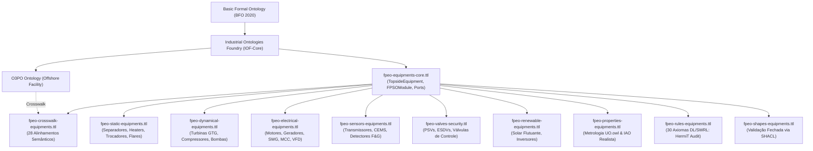
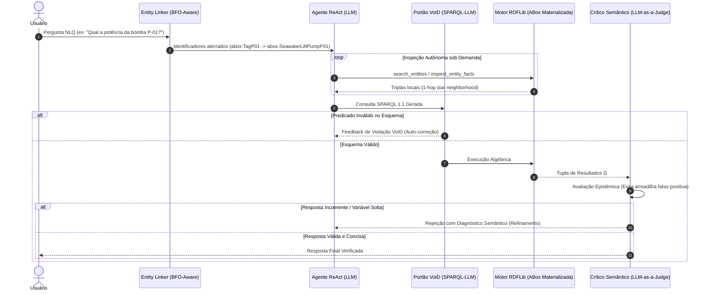

<p align="center">
  
</p>

# 🚢 FPEO-Reasoning: Ampliação da Ontologia O3PO para Modelagem e Auditoria Semântica de Equipamentos em FPSOs

[](https://www.python.org/)
[](https://nextjs.org/)
[](https://www.typescriptlang.org/)
[](https://www.w3.org/OWL/)
[](http://www.hermit-reasoner.com/)
[](https://doi.org/10.1007/978-3-031-60695-3_1)
[](LICENSE)
[](https://creativecommons.org/licenses/by/4.0/)

---

## 📌 Identificação Acadêmica e Institucional

* **Projeto:** Ampliação da Ontologia O3PO para modelagem de equipamentos em FPSOs
* **Instituição:** Universidade de São Paulo (USP) — Escola de Artes, Ciências e Humanidades (EACH)
* **Programa:** Programa Unificado de Bolsas (PUB - Edital 2025/2026)
* **Colaboração:** [OTIC-Dev (Offshore Technology Innovation Centre)](http://otic.poli.usp.br/)
* **Autor / Bolsista:** Hugo Cardoso Ferreira de Araújo (Nº USP: 15459500)
* **Orientação:** Prof. Dr. José de Jesus Pérez Alcázar
* **Documento Base:** [`Relatório_Parcial_Programa_Unificado_de_Bolsas_Hugo.pdf`](Relat%C3%B3rio_Parcial_Programa_Unificado_de_Bolsas_Hugo.pdf) (14 de Setembro de 2026)

---

## 📖 Visão Geral e Contexto Científico

A indústria de óleo e gás offshore enfrenta o desafio premente da transição energética e da descarbonização. Em unidades flutuantes de produção, armazenamento e transferência do tipo **FPSO (*Floating Production Storage and Offloading*)**, a combustão de combustíveis fósseis para geração termoelétrica responde por **mais de 60% das emissões totais de gases de efeito estufa (GEE)** da planta (*Gennari et al., 2024*). Iniciativas de eletrificação, integração de fontes renováveis e otimização operacional exigem a interoperabilidade massiva de dados em tempo real (*Hamidishad et al., 2025*).

Entretanto, as operações de engenharia sofrem com silos tecnológicos heterogêneos entre fabricantes e sistemas legados (*Santos et al., 2024*). A ontologia **O3PO (*Offshore Petroleum Production Plant Ontology*)** estabeleceu fundamentos essenciais para plantas offshore, porém apresentava lacunas na representação granular de equipamentos de superfície (*topside*), interfaces de conexões físicas/elétricas, modelagem metrológica estrita e verificação de regras de segurança de processos.

Este projeto propõe e implementa a **FPEO-Equipments (*FPSO Process and Equipment Ontology*)**, uma extensão modular em **OWL 2 DL** ancorada formalmente na **BFO 2020 (*Basic Formal Ontology*)** e na **IOF-Core (*Industrial Ontologies Foundry*)**. O repositório integra:
1. **Modelagem Ontológica Formal:** 9 submódulos OWL 2 DL alinhados a normas internacionais (API, ISO, IEC, DNV), regras de consistência em DL/SWRL e restrições estruturais em SHACL.
2. **Materialização e Raciocínio Lógico:** Automação de inferência e validação por refutação com o raciocinador **HermiT OWL DL** via JVM/JPype.
3. **FPEO-PID Studio:** Plataforma interativa full-stack (Next.js 16 + React Flow + Dagre + FastAPI) para autoria de diagramas P&ID em 4 níveis hierárquicos e auditoria de segurança em tempo real.
4. **Agente Autônomo Text-to-SPARQL:** Pipeline ReAct com inspeção dinâmica de grafo, portão anti-alucinação de esquema via descritores **VoID (*SPARQL-LLM*)** e validador reflexivo via **Crítico Semântico**, alcançando **92,75% de Exact Match** sobre 69 Perguntas de Competência.

---

## 🏛️ Arquitetura Semântica da FPEO-Equipments

A ontologia segue os preceitos do **Realismo Ontológico**, distinguindo rigorosamente artefatos materiais físicos (`bfo:MaterialEntity` $\rightarrow$ `iof-core:MaterialArtifact`), especificações de projeto prescritivas (`iof-core:DesignSpecification`), entidades de conteúdo informacional (`IAO:InformationContentEntity`) e grandezas escalares unificadas pela **UO (*Units of Measurement Ontology*)**.



### 🧩 Módulos Ontológicos Detalhados

| Módulo | Arquivo | Escopo Semântico & Normas Referenciadas | Classes | Obj. Prop. | Data Prop. | Axiomas DL |
| :--- | :--- | :--- | :---: | :---: | :---: | :---: |
| **Core** | `fpeo-equipments-core.ttl` | Vocabulário raiz, hierarquia de módulos espaciais (`FPSOModule`), decomposição de bocais/portas (`InletPort`, `OutletPort`, `ElectricalPort`, `SignalPort`) e topologia de fluxos (`portConnectedTo`, `feedsFluidToEquipment`, `powersEquipment`, `monitorsEquipment`). | 18 | 12 | 2 | 142 |
| **Static** | `fpeo-static-equipments.ttl` | Vasos de separação de fases, depuradores (*scrubbers*), aquecedores indiretos, tratadores eletrostáticos, hidrociclones, permutadores de calor casco-tubo, tochas (*flares*), vasos de alívio e coletores de drenagem perigosa/não perigosa. *(API 12J, API 12K, API 12L, API 14E, ISO 16812, ISO 23251)* | 40 | 4 | 0 | 210 |
| **Dynamical** | `fpeo-dynamical-equipments.ttl` | Maquinário rotativo: turbogeradores a gás (GTG), compressores centrífugos e parafuso (VRU), bombas de injeção e captação de água salgada, bombas dosadoras diafragma e decomposição meronímica de componentes (`hasContinuantPartAtAllTimes`: eixos, rotores, câmaras de combustão). *(ISO 10439, ISO 10440, ISO 13709, ISO 3977, API 11E, API 675)* | 32 | 6 | 0 | 185 |
| **Electrical** | `fpeo-electrical-equipments.ttl` | Infraestrutura elétrica topside: motores elétricos de indução, geradores principais (GTG) e de emergência (EDG), painéis de alta/baixa tensão (SWG-HV, SWG-LV), centros de controle de motores (MCC), transformadores de potência e inversores de frequência (VFD). *(IEC 60034, IEC 60076, IEC 61892)* | 11 | 3 | 0 | 88 |
| **Sensors** | `fpeo-sensors-equipments.ttl` | Instrumentação analítica e de supervisão: sistemas de monitoramento contínuo de emissões (CEMS/CO₂/NOₓ), transmissores de vazão, pressão, temperatura, sensores de vibração e detectores de fogo e gás. Padrão de tags ISA-5.1. | 14 | 4 | 0 | 94 |
| **Valves & Security** | `fpeo-valves-security.ttl` | Dispositivos de alívio e segurança de processo: válvulas de segurança e alívio de pressão (PSV), válvulas de corte rápido de emergência (ESDV), válvulas reguladoras e retenção. *(API 526, IEC 60534, ISO 15761)* | 11 | 2 | 0 | 76 |
| **Renewable** | `fpeo-renewable-equipments.ttl` | Sistemas para descarbonização e eletrificação offshore: arranjos fotovoltaicos solares marítimos flutuantes (*floating solar PV*), inversores fotovoltaicos e interfaces de hibridização de micro-redes. *(DNV-RP-0584, IEC 61215)* | 4 | 2 | 0 | 32 |
| **Properties** | `fpeo-properties-equipments.ttl` | Modelagem realista de grandezas metrológicas sem datatype properties soltas: especificações de projeto (`iof-core:DesignSpecification`), grandezas nominais e ancoragem na ontologia de unidades (`uo.owl`) e IAO. | 12 | 6 | 4 | 115 |
| **Crosswalk** | `fpeo-crosswalk-equipments.ttl` | Mapeamento semântico bidirecional de 28 classes e relações entre a FPEO e a ontologia de referência O3PO (`https://www.inf.ufrgs.br/ontologies/o3po#`). | – | – | – | 56 |
| **Rules** | `fpeo-rules-equipments.ttl` | 30 axiomas OWL 2 DL e regras SWRL para auditoria por refutação física: detecção de riscos de sobrepressão, conexão invertida de bocais, contaminação de drenagem aberta e segregação de barramentos elétricos. | – | – | – | 64 |
| **Shapes** | `fpeo-shapes-equipments.ttl` | Validação estrutural sob a hipótese de mundo fechado via W3C SHACL (verificação de tags ISA obrigatórias, conexões de portas e integridade topológica). | – | – | – | – |
| **TOTAL** | — | — | **142** | **39** | **6** | **1.062** |

---

## 📂 Estrutura Completa do Repositório

```text
FPEO-Reasoning/
├── Icon.jpeg                                      # Logotipo oficial do projeto
├── LICENSE                                        # Licença GNU General Public License v3.0 (GPL-3.0)
├── README.md                                      # Documentação técnica e guia de reprodutibilidade
├── requirements.txt                               # Dependências consolidadas do ecossistema Python
├── .gitignore                                     # Regras de exclusão de artefatos de build e temporários
├── Relatório_Parcial_Programa_Unificado_de_Bolsas_Hugo.pdf # Relatório técnico formal (42 páginas, USP/PUB)
│
├── ontologies_fpeo_equipments/                    # 📦 MÓDULOS ONTOLÓGICOS OWL 2 DL / TTL
│   ├── fpeo-equipments-core.ttl                  # Módulo núcleo e ancoragem espacial
│   ├── fpeo-static-equipments.ttl                # Módulo de equipamentos estáticos de processo
│   ├── fpeo-dynamical-equipments.ttl             # Módulo de maquinário rotativo e dinâmico
│   ├── fpeo-electrical-equipments.ttl            # Módulo de sistemas elétricos e potência
│   ├── fpeo-sensors-equipments.ttl               # Módulo de instrumentação e sensores
│   ├── fpeo-valves-security.ttl                  # Módulo de válvulas e segurança de processo
│   ├── fpeo-renewable-equipments.ttl             # Módulo de sistemas de energia renovável
│   ├── fpeo-properties-equipments.ttl            # Módulo metrológico em Realismo Ontológico
│   ├── fpeo-crosswalk-equipments.ttl             # Alinhamento formal com a O3PO
│   ├── fpeo-equipments-rules.ttl                 # Axiomas de consistência e integridade operacional
│   ├── fpeo-shapes-equipments.ttl                # Shapes SHACL para validação estrutural
│   ├── fpeo-collect-equipments-abox.ttl          # Instanciação da planta de processo (ABox)
│   ├── o3po.ttl                                  # Ontologia upstream O3PO
│   ├── uo.owl                                    # Unit of Measurement Ontology
│   ├── Core.rdf                                  # IOF-Core Release oficial
│   └── catalog-v001.xml                          # Catálogo XML de resolução local de IRIs
│
├── fpeo_agents/                                   # 🤖 MOTOR DE INFERÊNCIA, AGENTE TEXT-TO-SPARQL & BENCHMARK
│   ├── materialize_abox.py                       # Orquestrador de inferência OWL DL via HermiT
│   ├── reasoner_service.py                       # Ponte JVM / JPype com HermiT e OWL API
│   ├── generate_void_materialized.py             # Extrator de partições VoID a partir da ABox
│   ├── agent.py                                  # Agente ReAct Text-to-SPARQL com Crítico Semântico
│   ├── entity_linker.py                          # Aterramento dinâmico BFO-Aware de tags ISA-5.1
│   ├── tools.py                                  # Ferramentas autônomas do agente (search/inspect)
│   ├── sparql_parser.py                          # Compilador e normalizador canônico de namespaces
│   ├── config.py                                 # Parâmetros de inferência LLM e endpoints
│   ├── ground_truth.json                         # Padrão-ouro com 69 Perguntas de Competência
│   ├── benchmark_cientific_eval.py               # Suíte científica de avaliação empírica
│   ├── plot_benchmark.py                         # Geração automatizada de gráficos para publicação
│   ├── main.py                                   # Interface de linha de comando interativa para consultas
│   ├── requirements.txt                          # Dependências específicas do módulo de agentes
│   ├── lib/                                      # Bibliotecas Java embarcadas para HermiT
│   │   ├── HermiT.jar                            # HermiT OWL DL Reasoner 1.4.x
│   │   └── owlapi-osgidistribution-4.5.25.jar    # OWL API 4.5.25
│   ├── results/                                  # Relatórios brutos de execução do benchmark
│   │   └── benchmark_evaluation_report_gemma_12b.json # Telemetria e métricas de 69 CQs
│   └── images2/                                  # Gráficos acadêmicos exportados em alta resolução
│       ├── benchmark_accuracy.png                # Comparativo Pass@1 vs EM Final e subdomínios
│       └── benchmark_telemetry.png               # Custos cognitivos, chamadas a ferramentas e latência
│
├── fpeo_pid/                                      # 💻 FPEO-PID STUDIO: PLATAFORMA GRÁFICA & AUDITORIA
│   ├── README.md                                 # Documentação da aplicação web
│   ├── LICENSE.md                                # GNU GPL v3.0
│   └── src/
│       ├── app/                                  # Rotas e páginas em Next.js 16 (App Router)
│       ├── components/                           # Componentes visuais do canvas P&ID e React Flow
│       ├── lib/                                  # Utilitários de manipulação de grafos e RDF (N3.js)
│       ├── package.json                          # Dependências Node.js / React 19 / Tailwind
│       └── server/                               # Backend em FastAPI
│           ├── main.py                           # Servidor HTTP / API REST
│           ├── reasoner.py                       # Validador de consistência via Owlready2 e HermiT
│           ├── llm_explainer.py                  # Explicabilidade de falhas via Ollama (Llama 3) / Gemini
│           ├── graph_explorer.py                 # Extração de sub-grafos de contexto via NetworkX
│           └── requirements.txt                  # Dependências Python do backend web
│
├── ontologies_otic/                               # 🏢 PACOTE DE INTEGRAÇÃO OTIC-DEV
│   ├── PRODUCTION_BASELINE/                      # Ontologias de referência imutáveis da produção
│   ├── CANDIDATE_JSON/                           # Arquitetura modular candidata com compatibilidade JSON
│   ├── run_validation.py                         # Script de verificação de integridade formal
│   └── REPORTS/                                  # Resumos de entrega e auditoria de cobertura
│
├── fundamentations/                               # 📚 FUNDAMENTAÇÃO TEÓRICA & MEMORIAIS DE MODELAGEM
│   ├── DATA_PROPERTIES_MODELING.md               # Diretrizes de modelagem realista de grandezas físicas
│   ├── IAO_Ontology_Explanation.pdf              # Especificação da Information Artifact Ontology
│   ├── Allen_Interval_Algebra_and_IOF_Foundry_Ontologies.pdf # Álgebra temporal de Allen na IOF
│   └── Ontology_Benefits.pdf                     # Estudo sobre governança semântica e silos de dados
│
└── external vocabulary/                           # 📜 NORMAS TÉCNICAS E REFERÊNCIAS INDUSTRIAIS
    ├── 01_Static_Equipments/                     # API 12J, 12K, 12L, 14E, ISO 16812, 23251
    ├── 02_Dynamical_Equipments/                  # ISO 10439, 10440, 13709, 3977, API 11E, 675
    ├── 03_Electrical_Equipments/                 # IEC 60034, 60076, 61892
    ├── 04_Valves_and_Security/                   # API 526, IEC 60534, ISO 15761
    ├── 05_Renewable_and_Energy_Transition/       # DNV-RP-0584, IEC 61215
    └── 06_Emissions_and_Environment/             # ISO 14064-2
```

---

## 🔬 Agente Autônomo Text-to-SPARQL & Validação VoID

Para superar as limitações do RAG vetorial ingênuo e da geração cega de consultas SPARQL em grafos industriais, foi desenvolvido um pipeline de seis camadas com **dois circuitos de retroalimentação semântica**:



---

## 📊 Resultados do Benchmark Científico

O sistema foi submetido a uma bateria de avaliação empírica contra o padrão-ouro formal (`ground_truth.json`), composto por **69 Perguntas de Competência (CQs)** derivadas dos requisitos funcionais do DOC-SPEC (Metodologia SaBiOx).

### 📈 Indicadores Globais de Desempenho

| Métrica de Avaliação | Resultado Obtido |
| :--- | :---: |
| **Exact Match Accuracy (EM)** | **92,75%** (64 / 69 CQs) |
| **Macro F1-Score** | **94,69%** |
| **Macro Precision** | **94,20%** |
| **Macro Recall** | **95,65%** |
| **Taxa Pass@1 (Zero-Shot inicial)** | **63,77%** (44 / 69 CQs) |
| **Ganho Epistêmico do Crítico Semântico ($\Delta$Crítico)** | **+28,98 p.p.** *(20 CQs recuperadas)* |
| **Taxa de Validade Sintática SPARQL** | **98,55%** |
| **Total de Chamadas a Ferramentas** | **408** ($\mu = 5,91$ chamadas/CQ) |
| **Distribuição de Ferramentas** | 191 *search_entities* / 217 *inspect_entity_facts* |
| **Rejeições Efetuadas pelo Crítico Semântico** | **42 intervenções** |
| **Alucinações de Esquema Barradas via VoID** | **1 ocorrência** |

### 🎯 Desempenho Discriminado por Subdomínio Ontológico

| Subdomínio Ontológico | Perguntas ($N$) | Exact Match (%) | Macro F1 (%) | Pass@1 (%) | Chamadas de Ferramentas | Intervenções do Crítico |
| :--- | :---: | :---: | :---: | :---: | :---: | :---: |
| **Dynamical** | 7 | **100,00%** | **100,00%** | 42,86% | 31 | 5 |
| **Core** | 28 | **96,43%** | **98,81%** | 89,29% | 55 | 4 |
| **Electrical** | 13 | **92,31%** | **92,31%** | 92,31% | 32 | 1 |
| **Properties & Metrology** | 19 | **89,47%** | **92,98%** | 21,05% | 211 | 29 |
| **Static** | 2 | **50,00%** | **50,00%** | 0,00% | 79 | 3 |

> [!NOTE]
> O subdomínio **Properties & Metrology** concentrou a maior densidade computacional devido à navegação encadeada exigida pelo Realismo Ontológico da IOF-Core (`iof-core:prescribes`, partes temporais e expressões escalares). O Crítico Semântico atuou 29 vezes neste subdomínio, elevando o resultado de 21,05% (Pass@1) para 89,47% (EM Final).

---

## 🛠️ Guia Passo a Passo de Reprodutibilidade Científica

Para garantir a estrita reprodutibilidade dos experimentos, benchmarks e aplicações apresentados no relatório, siga o roteiro a seguir.

### 1. Pré-requisitos de Sistema

* **Sistema Operacional:** Linux (testado em Fedora Linux / Ubuntu 22.04+), macOS ou Windows (WSL2).
* **Python:** Versão 3.10 ou superior (testado com Python 3.10, 3.11, 3.12 e 3.13).
* **Java Runtime:** JRE/JDK 11, 17 ou 21 (necessário para a JVM do raciocinador HermiT).
* **Node.js:** Versão 18.0.0+ (com npm).
* **Motor de Inferência LLM:** `llama-server` (`llama.cpp`) com modelo GGUF (ex: `gpt-oss-20b` ou `gemma-2-9b`/`12b`) ou endpoint compatível com OpenAI API (Ollama / vLLM / LiteLLM).

```bash
# Verificar versões das ferramentas no sistema
python3 --version
java -version
node -v
npm -v
```

---

### 2. Configuração do Ambiente Virtual Python

Clone o repositório e crie um ambiente virtual dedicado:

```bash
git clone https://github.com/TheHugoHypothesis/FPEO-Reasoning.git
cd FPEO-Reasoning

python3 -m venv .venv
source .venv/bin/activate

# Instalar as dependências globais consolidadas
pip install --upgrade pip
pip install -r requirements.txt
```

---

### 3. Materialização e Raciocínio Formal ABox (HermiT OWL DL)

O primeiro passo da esteira consiste em compilar todos os módulos ontológicos (`.ttl`), carregar as regras e axiomas no raciocinador formal **HermiT** e materializar o grafo deduções inferidas:

```bash
cd fpeo_agents
python materialize_abox.py
```

**Saída esperada:**
* Execução do HermiT via Java Virtual Machine (JPype);
* Diagnóstico de consistência lógica: `Status Lógico: VÁLIDO / CONSISTENTE`;
* Deduções adicionadas e gravação do grafo consistente em `fpeo_materialized.ttl`.

---

### 4. Sincronização dos Descritores Semânticos VoID

Com a ABox materializada, gere as partições de classes e propriedades do vocabulário VoID, utilizadas pelo portão anti-alucinação de esquema:

```bash
python generate_void_materialized.py
```

**Saída esperada:**
* Mapeamento de subclasses e predicados;
* Criação do arquivo `fpeo_void.ttl` contendo as partições canônicas de dataset.

---

### 5. Inicialização do Servidor LLM Local

O benchmark utiliza por padrão um servidor local compatível com a API da OpenAI na porta `8080`. Se estiver utilizando `llama.cpp` (`llama-server`):

```bash
# Exemplo com llama-server (Parâmetros da Tabela 12 do Relatório)
llama-server \
  -m /caminho/para/modelo-20b-ou-12b.gguf \
  --port 8080 \
  -c 32768 \
  -ngl 999 \
  -fa \
  -b 1024 \
  -ub 1024 \
  --jinja
```

*Caso utilize Ollama, execute `ollama serve` e aponte `LLAMA_ENDPOINT = "http://localhost:11434/v1"` em [`fpeo_agents/config.py`](fpeo_agents/config.py).*

---

### 6. Execução do Benchmark Científico das 69 CQs

Execute a suíte formal de avaliação para aferir a acurácia estrita (*Exact Match*), F1-Score e telemetria:

```bash
python benchmark_cientific_eval.py
```

O script iterará sobre as 69 questões mapeadas no [`ground_truth.json`](fpeo_agents/ground_truth.json), registrando:
* Tempo de resposta e chamadas às ferramentas;
* Eventuais alucinações barradas pelo VoID;
* Intervenções reflexivas do Crítico Semântico;
* Exportação do relatório estruturado em `fpeo_agents/results/benchmark_evaluation_report.json`.

---

### 7. Geração Automatizada dos Gráficos de Publicação

Para gerar as figuras científicas apresentadas no relatório parcial:

```bash
python plot_benchmark.py
```

Os gráficos vetoriais e em alta definição serão salvos no diretório `fpeo_agents/images2/`:
* `benchmark_accuracy.png`: Ganho epistêmico (Pass@1 vs. EM Final) e acurácia por subdomínio;
* `benchmark_telemetry.png`: Dispersão de chamadas a ferramentas e latência computacional.

---

### 8. Execução do FPEO-PID Studio (Aplicação Gráfica)

O **FPEO-PID Studio** fornece uma interface visual completa para diagramação P&ID, visualização de frotas e auditoria em tempo real.

#### Iniciar o Backend (FastAPI & HermiT Reasoner)
Em um novo terminal (com o ambiente virtual ativo):
```bash
cd fpeo_pid/src/server
pip install -r requirements.txt
python main.py
```
*A API REST estará operacional em `http://localhost:8000` (Swagger em `http://localhost:8000/docs`).*

#### Iniciar o Frontend (Next.js 16 & React Flow)
Em outro terminal:
```bash
cd fpeo_pid/src
npm install
npm run dev
```
*Acesse o estúdio interativo no navegador em: **`http://localhost:3000`**.*

---

## 🖥️ Especificações do Ambiente de Teste Original

Conforme registrado na Seção 4.5.1 do Relatório Parcial, o benchmark foi originalmente executado na seguinte configuração:

* **Processador:** AMD Ryzen 7 7700 (16 threads, até 5,39 GHz)
* **Memória RAM:** 32 GB DDR5
* **Acelerador Gráfico (GPU):** NVIDIA GeForce RTX 4060 Ti (16 GB VRAM) — *Offload integral de camadas*
* **Sistema Operacional:** Linux (Kernel 7.2.5 / Fedora 44)
* **Tempo Total de Execução (69 CQs):** 1.446,47 segundos (~24,1 minutos)
* **Latência Média por Consulta:** 20,96 segundos (refletindo inspeção multi-hop e ciclos de auto-correção)

---

## 📜 Licença e Termos de Uso

* **Código-Fonte e Software:** Disponibilizado sob a licença **[GNU General Public License v3.0 (GPL-3.0)](LICENSE)**.
* **Artefatos Ontológicos e Especificações:** As ontologias formais (`.ttl`, `.owl`, `.rdf`), vocabulários VoID e documentação técnica são distribuídos sob a licença internacional **[Creative Commons Attribution 4.0 (CC BY 4.0)](https://creativecommons.org/licenses/by/4.0/)**.

---

## 📝 Como Citar este Trabalho

Se você utilizar a ontologia **FPEO-Equipments**, o **FPEO-PID Studio** ou a arquitetura **Text-to-SPARQL** em sua pesquisa acadêmica ou projeto industrial, por favor cite:

```bibtex
@techreport{araujo2026fpeo,
  title       = {Ampliação da Ontologia O3PO para modelagem de equipamentos em FPSOs},
  author      = {Araújo, Hugo Cardoso Ferreira de and Alcázar, José de Jesus Pérez},
  institution = {Universidade de São Paulo (EACH-USP) / Offshore Technology Innovation Centre (OTIC)},
  type        = {Relatório Técnico de Iniciação Científica - PUB},
  year        = {2026},
  month       = {September},
  address     = {São Paulo, Brasil},
  note        = {Disponível em: https://github.com/TheHugoHypothesis/FPEO-Reasoning}
}
```

---

## 🤝 Agradecimentos

O autor expressa seus sinceros agradecimentos:
* À **Universidade de São Paulo (USP)** e à **Escola de Artes, Ciências e Humanidades (EACH)** pelo fomento concedido através do **Programa Unificado de Bolsas (PUB)**;
* Ao orientador **Prof. Dr. José de Jesus Pérez Alcázar** pela condução metodológica e apoio científico;
* Aos pesquisadores e engenheiros colaboradores do **Offshore Technology Innovation Centre (OTIC-Dev)** pelas diretrizes de domínio e bases conceituais de engenharia offshore.
