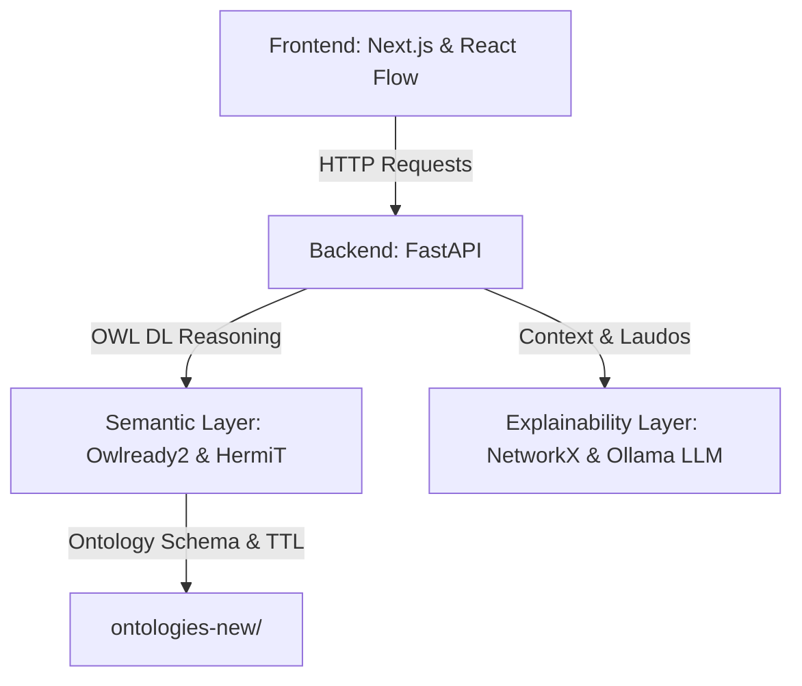

# ⚡ FPEO PID: Semantic Audit & Multi-FPSO Equipments Visualization

[](https://nextjs.org/)
[](https://fastapi.tiangolo.com/)
[](https://www.typescriptlang.org/)
[](https://www.python.org/)
[](https://www.w3.org/OWL/)

O **FPEO PID** é uma plataforma de modelagem ontológica OWL/RDF e auditoria de segurança de processos topside em instalações offshore (*FPSOs*).

O sistema combina a precisão da engenharia de conhecimento semântico com visualização diagramática hierárquica em 4 níveis (Frota Multi-FPSO, Módulos Topside, Equipamentos P&ID e Sub-grafos de Componentes) e auditoria lógica em tempo real alimentada pelo raciocinador **HermiT OWL DL** e explicação por IA.

---

## 🏗️ Arquitetura do Sistema

O sistema é estruturado em quatro camadas integradas e desacopladas para processamento semântico e visualização interativa:



1. **Camada de Apresentação (Frontend):** Interface web interativa em **Next.js 16 (React Flow)** para edição visual de P&ID, sincronização ABox/TTL em tempo real e visualização de frota multi-FPSO.
2. **Camada de Serviços (Backend API):** Servidor **FastAPI (Python)** que orquestra a validação ontológica e a comunicação com o motor de inferência e a LLM.
3. **Camada Semântica (Semantic Web):** Processamento de ontologias OWL 2.0 e verificação de consistência lógica via **Owlready2** e raciocinador formal **HermiT OWL DL**.
4. **Camada de Explicabilidade (GraphRAG & IA):** Extração de sub-grafos contextuais de inconsistências com **NetworkX** e geração automática de laudos de segurança via **Ollama (Llama 3)**.

---

## 🛠️ Tecnologias Utilizadas

* **Linguagens Principais:** TypeScript, Python 3.10
* **Framework Web Frontend:** Next.js 16 (App Router & Turbopack), React Flow (@xyflow/react), Dagre
* **Framework Web Backend:** FastAPI (Uvicorn & CORS)
* **Engenharia Semântica & Inferência:** Owlready2, HermiT Reasoner (Java Runtime), N3.js, RDFLib
* **Análise de Grafos & LLM:** NetworkX, Ollama API (Llama 3 / Llama 3.1)
* **Estilização UI:** Vanilla CSS + TailwindCSS (Glassmorphism & Industrial Dark Theme)

---

## 🚀 Como Executar o Projeto

### 1. Pré-requisitos
* **Node.js** v18+ e **npm**
* **Python** 3.10+
* **Java Runtime (JRE 11+)** (necessário para o HermiT Reasoner)
* **Ollama** *(opcional, para geração de laudos em linguagem natural)*

### 2. Iniciar o Backend (FastAPI & HermiT)
```bash
cd src/server
pip install -r requirements.txt
python main.py
```
*(O backend rodará em `http://localhost:8000`)*

### 3. Iniciar o Frontend (Next.js)
```bash
cd src
npm install
npm run dev
```
*(O frontend rodará em `http://localhost:3000`)*

### 4. Acessar a Aplicação
* **Interface Web:** [http://localhost:3000](http://localhost:3000)
* **Documentação da API (Swagger UI):** [http://localhost:8000/docs](http://localhost:8000/docs)

---

## 📊 Principais Endpoints da API

* `GET /health` - Verifica o status operacional do backend e do raciocinador HermiT.
* `POST /api/audit` - Executa a auditoria ontológica das triplas Turtle (`.ttl`) via HermiT e gera laudos explicativos via Ollama LLM.
* `POST /api/explain` - Recebe justificativas formais de inconsistências e gera o relatório técnico de segurança de processos.
