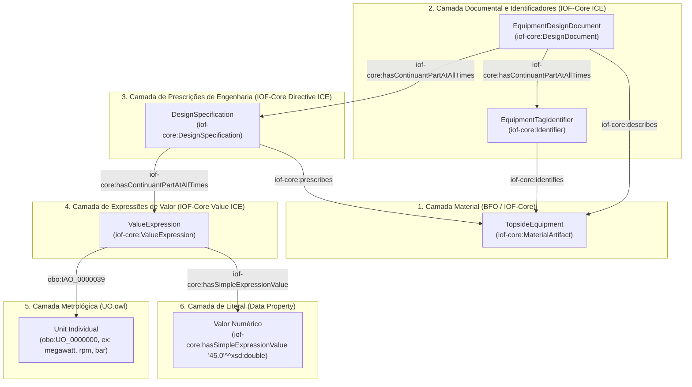

# Guia de Modelagem de Propriedades de Dados e Entidades Informacionais na FPEO
**Fundamentação Teórica: Realismo Ontológico (BFO 2020), Industrial Ontologies Foundry (IOF-Core) e Unit of Measurement Ontology (UO)**

**Autor:** Hugo Cardoso Ferreira de Araújo  
**Ontologia:** FPEO-PID (Floating Production Equipment Ontology for P&ID)  
**Módulo:** `fpeo-properties-equipments.ttl`

---

## 1. Introdução e Princípios Fundamentais

Nas ontologias fundamentadas no **Realismo Ontológico** (como a *Basic Formal Ontology* - BFO e a *Industrial Ontologies Foundry* - IOF), propriedades de dados de engenharia (como potência nominal, vazão de projeto, pressão de trabalho, temperatura de entrada) **não devem ser anexadas diretamente a entidades materiais físicas como literais puros estáticos** (por exemplo, `:Turbina :hasRatedPower "45.0"^^xsd:double`).

Essa proibição decorre de princípios ontológicos rigorosos:
1. **Distinção entre Mundo Material e Mundo Informacional:** Uma turbina a gás física é um *Material Artifact* (`iof-core:MaterialArtifact` $\sqsubseteq$ `bfo:MaterialEntity`). Uma potência de projeto de "45 MW" não é uma parte física da turbina nem uma qualidade intrínseca pura, mas sim um **artefato informacional prescritivo** gerado por engenheiros em um documento de especificação técnica.
2. **Separação entre Prescrição de Projeto e Medição Observacional:** Um limite nominal de catálogo é uma diretriz (*Design Specification* / *Requirement*), enquanto o sinal instantâneo lido por um sensor em operação é um dado de medição (*Measured Value*).
3. **Indissociabilidade da Unidade de Medida:** Um valor numérico puramente literal ("45.0") é semanticamente incompleto e ambíguo sem sua unidade padronizada (`megawatt`, `rpm`, `bar`, `degree Celsius`), a qual deve ser instanciada a partir de uma ontologia metrológica padronizada (**UO.owl**).

---

## 2. Arquitetura em Camadas (IOF-Core + UO + BFO)

A modelagem de dados da FPEO estrutura-se nas seguintes camadas formais:



---

## 3. Taxonomia de Classes no Módulo `fpeo-properties-equipments.ttl`

### 3.1 Documentos e Identificadores
* **`prop:EquipmentDesignDocument`** ($\sqsubseteq$ `iof-core:DesignDocument`): Coleção organizada de entidades de conteúdo informacional (datasheet/folha de dados) que descreve o equipamento físico.
* **`prop:EquipmentTagIdentifier`** ($\sqsubseteq$ `iof-core:Identifier`): Identificador único do equipamento de acordo com a norma de instrumentação e tubulação (ex: ISA-5.1).
* **`prop:ModelIdentifier`** ($\sqsubseteq$ `iof-core:Identifier`): Identificador do modelo de catálogo ou part number do fabricante.

### 3.2 Especificações e Prescrições de Projeto (`iof-core:DesignSpecification`)
Diretivas de engenharia que prescrevem limites ou condições operacionais de projeto para o equipamento:
* `prop:RatedPowerSpecification`: Especificação de potência nominal (ISO 3977-1).
* `prop:RatedSpeedSpecification`: Especificação de rotação nominal (RPM).
* `prop:HeatRateSpecification`: Especificação de consumo térmico específico.
* `prop:ThermalEfficiencySpecification`: Especificação de rendimento térmico de projeto.
* `prop:TurbineInletTemperatureSpecification`: Especificação da temperatura de entrada da turbina (TIT).
* `prop:ExhaustGasTemperatureSpecification`: Especificação da temperatura dos gases de escape (EGT).
* `prop:DesignPressureSpecification`: Pressão máxima de projeto / MAWP.
* `prop:DesignTemperatureSpecification`: Temperatura máxima/mínima de projeto.
* `prop:DesignFlowRateSpecification`: Capacidade nominal de vazão.

### 3.3 Expressões de Valor de Engenharia (`iof-core:ValueExpression`)
Entidades informacionais que encapsulam o par **(Unidade de Medida, Magnitude Numérica)**:
* `prop:PowerValueExpression`: Expressão de grandeza de potência (acoplada a unidades como `watt`, `megawatt`).
* `prop:SpeedValueExpression`: Expressão de velocidade angular/rotação (acoplada a `rpm`, `hertz`).
* `prop:TemperatureValueExpression`: Expressão de temperatura (acoplada a `degree Celsius`, `kelvin`).
* `prop:PressureValueExpression`: Expressão de pressão (acoplada a `bar`, `pascal`, `psi`).
* `prop:FlowRateValueExpression`: Expressão de vazão mássica ou volumétrica.
* `prop:HeatRateValueExpression`: Expressão de taxa de calor consumida.
* `prop:EfficiencyValueExpression`: Expressão percentual ou adimensional de rendimento.

---

## 4. Relações e Propriedades Reutilizadas

| Propriedade | Tipo | Domínio | Alcance | Descrição |
| :--- | :--- | :--- | :--- | :--- |
| **`iof-core:describes`** | Object | `iof-core:InformationContentEntity` | `bfo:Entity` | Conecta o documento técnico ao equipamento físico. |
| **`iof-core:prescribes`** | Object | `iof-core:DesignSpecification` | `bfo:Entity` | Estabelece que uma especificação prescreve critérios para o equipamento. |
| **`iof-core:isPrescribedBy`** | Object | `bfo:Entity` | `iof-core:DesignSpecification` | Inversa de `prescribes`. |
| **`iof-core:identifies`** | Object | `iof-core:Identifier` | `bfo:Entity` | Conecta a Tag/ID diretamente ao equipamento físico. |
| **`iof-core:hasContinuantPartAtAllTimes`** | Object | `bfo:Continuant` | `bfo:Continuant` | Mereologia informacional (Documento $\rightarrow$ Especificações $\rightarrow$ Expressões de Valor). |
| **`obo:IAO_0000039`** (*has measurement unit label*) | Object | `iof-core:ValueExpression` | `obo:UO_0000000` (*Unit*) | Conecta a expressão de valor à instância padronizada da **UO.owl**. |
| **`iof-core:hasSimpleExpressionValue`** | Data | `iof-core:ValueExpression` | `rdfs:Literal` | Atribui a magnitude numérica pura (ex: `"45.0"^^xsd:double`). |

---

## 5. Axiomatização em Description Logics (DL)

### 5.1 Restrição de Completude do Par Valor-Unidade
Toda `ValueExpression` instanciada **deve obrigatoriamente** possuir uma unidade de medida da UO e um valor numérico associado:
$$\text{iof-core:ValueExpression} \sqsubseteq \exists \text{obo:IAO\_0000039}.\text{obo:UO\_0000000} \sqcap \exists \text{iof-core:hasSimpleExpressionValue}.\text{Literal}$$

### 5.2 Restrição da Especificação de Projeto
Toda `DesignSpecification` deve prescrever um equipamento de topo e conter ao menos uma expressão de valor:
$$\text{iof-core:DesignSpecification} \sqsubseteq \exists \text{iof-core:prescribes}.\text{core:TopsideEquipment} \sqcap \exists \text{iof-core:hasContinuantPartAtAllTimes}.\text{iof-core:ValueExpression}$$

---

## 6. Exemplo Prático de Instanciação no ABox (Turtle)

Cenário: Turbina a Gás de Geração Principal (**GTG-01**) com potência nominal de **45.0 MW** e rotação nominal de **5100.0 RPM**:

```turtle
@prefix : <http://usp.ai/ontologies/fpeo-collect-equipments-abox#> .
@prefix core: <http://usp.ai/ontologies/fpeo-equipments-core#> .
@prefix dynamical: <http://usp.ai/ontologies/fpeo-dynamical-equipments#> .
@prefix prop: <http://usp.ai/ontologies/fpeo-properties-equipments#> .
@prefix iof-core: <https://spec.industrialontologies.org/ontology/core/Core/> .
@prefix uo: <http://purl.obolibrary.org/obo/> .
@prefix xsd: <http://www.w3.org/2001/XMLSchema#> .

# 1. ENTIDADE MATERIAL (EQUIPAMENTO REAL)
:MainTurbineGenerator_GTG01 rdf:type dynamical:SingleShaftGasTurbine ;
    rdfs:label "GTG-01 Main Gas Turbine Generator"@en .

# 2. DOCUMENTO DE PROJETO (DATASHEET)
:Datasheet_GTG01 rdf:type prop:EquipmentDesignDocument ;
    rdfs:label "Datasheet Técnico do Turbogerador GTG-01"@pt ;
    iof-core:describes :MainTurbineGenerator_GTG01 ;
    iof-core:hasContinuantPartAtAllTimes :Tag_GTG01 , 
                                        :Spec_RatedPower_GTG01 , 
                                        :Spec_RatedSpeed_GTG01 .

# 3. TAG IDENTIFICADORA
:Tag_GTG01 rdf:type prop:EquipmentTagIdentifier ;
    iof-core:identifies :MainTurbineGenerator_GTG01 ;
    iof-core:hasSimpleExpressionValue "GTG-01" .

# 4. ESPECIFICAÇÕES DE PROJETO (PRESCRIÇÕES)
:Spec_RatedPower_GTG01 rdf:type prop:RatedPowerSpecification ;
    rdfs:label "Especificação de Potência Nominal"@pt ;
    iof-core:prescribes :MainTurbineGenerator_GTG01 ;
    iof-core:hasContinuantPartAtAllTimes :Val_Power_45MW .

:Spec_RatedSpeed_GTG01 rdf:type prop:RatedSpeedSpecification ;
    rdfs:label "Especificação de Rotação Nominal"@pt ;
    iof-core:prescribes :MainTurbineGenerator_GTG01 ;
    iof-core:hasContinuantPartAtAllTimes :Val_Speed_5100RPM .

# 5. EXPRESSÕES DE VALOR COM UNIDADES UO E LITERAIS NUMÉRICOS
:Val_Power_45MW rdf:type prop:PowerValueExpression ;
    obo:IAO_0000039 uo:UO_0000037 ;                  # megawatt (UO.owl)
    iof-core:hasSimpleExpressionValue "45.0"^^xsd:double .

:Val_Speed_5100RPM rdf:type prop:SpeedValueExpression ;
    obo:IAO_0000039 uo:UO_0000106 ;                  # revolutions per minute (UO.owl)
    iof-core:hasSimpleExpressionValue "5100.0"^^xsd:double .
```

---

## 7. Exemplos de Consultas SPARQL

### 7.1 Recuperar todos os Equipamentos, suas Tags e Potências Nominais com Unidades
```sparql
PREFIX iof-core: <https://spec.industrialontologies.org/ontology/core/Core/>
PREFIX prop: <http://usp.ai/ontologies/fpeo-properties-equipments#>
PREFIX obo: <http://purl.obolibrary.org/obo/>
PREFIX rdfs: <http://www.w3.org/2000/01/rdf-schema#>

SELECT ?equipment ?tag ?powerValue ?unitLabel
WHERE {
    # 1. Recupera o Equipamento e sua Tag
    ?tagId iof-core:identifies ?equipment ;
           iof-core:hasSimpleExpressionValue ?tag .
    
    # 2. Recupera a Especificação de Potência que prescreve o Equipamento
    ?spec a prop:RatedPowerSpecification ;
          iof-core:prescribes ?equipment ;
          iof-core:hasContinuantPartAtAllTimes ?valExpr .
    
    # 3. Recupera o Valor Literal e o Rótulo da Unidade da UO
    ?valExpr iof-core:hasSimpleExpressionValue ?powerValue ;
             obo:IAO_0000039 ?unit .
    
    ?unit rdfs:label ?unitLabel .
}
```

### 7.2 Filtrar Equipamentos com Potência Superior a um Limite (Raciocínio Quantitativo)
```sparql
PREFIX iof-core: <https://spec.industrialontologies.org/ontology/core/Core/>
PREFIX prop: <http://usp.ai/ontologies/fpeo-properties-equipments#>
PREFIX xsd: <http://www.w3.org/2001/XMLSchema#>

SELECT ?equipment ?powerValue
WHERE {
    ?spec a prop:RatedPowerSpecification ;
          iof-core:prescribes ?equipment ;
          iof-core:hasContinuantPartAtAllTimes ?valExpr .
    
    ?valExpr iof-core:hasSimpleExpressionValue ?powerValue .
    
    FILTER (xsd:double(?powerValue) >= 30.0)
}
```
